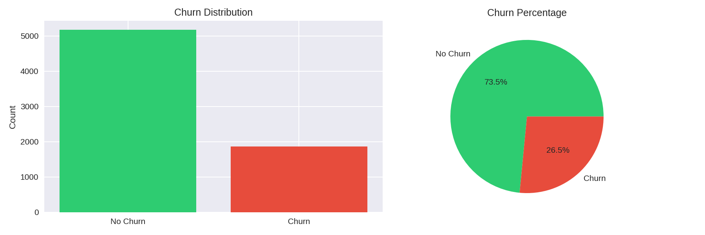
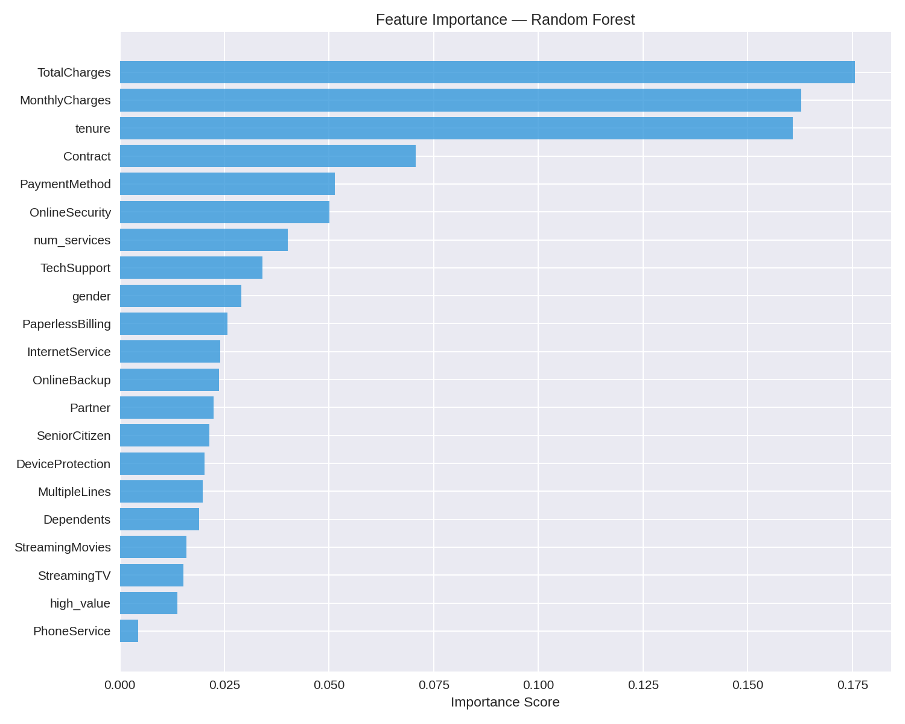
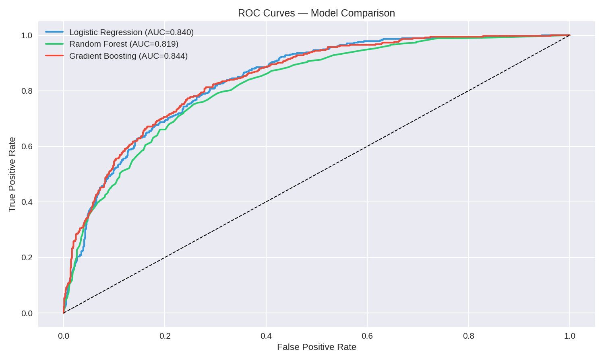

# 🔮 Customer Churn Intelligence Platform

An end-to-end machine learning platform that predicts customer churn for telecom companies, built with production-grade tools.

## 📊 Project Overview

This platform analyzes customer behavior to predict churn probability and identify high-risk customers before they leave — directly impacting revenue retention.

**Key Results:**
- 🎯 AUC Score: **0.84** (industry standard is 0.80+)
- 📉 Top churn drivers identified: contract type, internet service, payment method
- 🔮 Real-time churn prediction via REST API

## 🛠️ Tech Stack

| Layer | Technology |
|-------|------------|
| ML Model | Python, Scikit-learn, Gradient Boosting |
| Analysis | Pandas, NumPy, Matplotlib, Seaborn |
| Backend | FastAPI, Uvicorn, Docker |
| Frontend | React, TypeScript, Recharts |
| Infrastructure | Docker, Docker Compose |

## 📁 Project Structure
customer-churn-platform/
├── notebook/                  # EDA, feature engineering, model training
│   └── churn_analysis.ipynb
├── model/
│   └── artifacts/             # Trained model, scaler, feature list
├── api/                       # FastAPI backend
│   ├── main.py
│   ├── predict.py
│   ├── schema.py
│   ├── retrain.py
│   └── Dockerfile
├── frontend/                  # React + TypeScript dashboard
│   └── src/
│       └── components/
│           ├── Dashboard.tsx
│           └── PredictForm.tsx
└── docker-compose.yml

## ⚡ Quick Start

**Prerequisites:** Docker Desktop, Node.js

**1. Clone the repo:**
```bash
git clone https://github.com/A7MAD-04/customer-churn-platform.git
cd customer-churn-platform
```

**2. Add the dataset:**

Download from [Kaggle — IBM Telco Customer Churn](https://www.kaggle.com/datasets/blastchar/telco-customer-churn) and place `WA_Fn-UseC_-Telco-Customer-Churn.csv` in the `data/` folder.

**3. Start the API:**
```bash
docker compose up
```
API available at: `http://localhost:8000/docs`

**4. Start the frontend:**
```bash
cd frontend
npm install
npm run dev
```
Frontend available at: `http://localhost:5173`

## 📈 Key Findings

- **Contract type** is the #1 churn predictor — month-to-month customers churn 14x more than two-year contract customers
- **Fiber optic** customers churn at 42% despite paying more — likely due to pricing dissatisfaction  
- **Electronic check** payment method has the highest churn rate at 45%
- **Short tenure** customers (0-12 months) are the highest risk group

## 📉 Model Performance

| Model | AUC Score | Accuracy |
|-------|-----------|----------|
| Gradient Boosting | **0.8435** ✅ | 80% |
| Logistic Regression | 0.8397 | 80% |
| Random Forest | 0.8191 | 78% |

## 🖼️ Screenshots

### Dashboard


### Feature Importance


### ROC Curves
